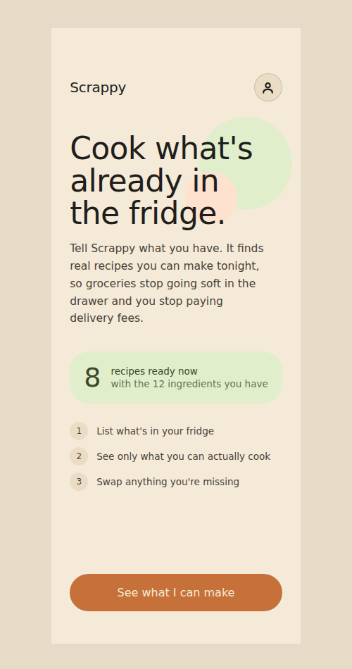
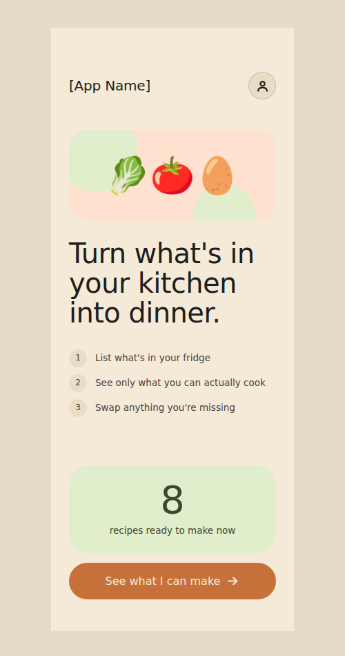

# [App Name] — IS551 First Three Screens

**Live prototype:** https://karensakuma.github.io/IS551-FirstThreeScreens/
**Repo:** https://github.com/karenSakuma/IS551-FirstThreeScreens

## 1. Need, Persona, Capability, Value

**Need:** Busy college students don't have the time or energy to figure out what they can cook with what's already in the fridge, so they order takeout or repeat the same easy meal every day, spending money and letting other groceries go to waste.

**Persona:** Cooks for themselves almost every night, shops without a strict grocery list but wants to save money, and spends way more time trying to figure out what to eat than actually eating.

**Capability:** Show recipes you can make right now, using what's already in your kitchen.

**Value:** Control. Dinner gets sorted out without spending on takeout or letting food go to waste.

## 2. The three screens

| Screen | Single job | Why it earned a slot | Design question it examines |
| --- | --- | --- | --- |
| **1. Landing** | Show the user what the app can do and why it's worth using | It's the only screen every user sees before deciding whether to look further | Does the user understand what this app does and why it matters within the first few seconds? |
| **2. Recipe list** | Turn "I don't know what to make" into an actual dish | It's the proof that the app does what it says, right after the landing screen's promise | Can the user navigate this screen easily enough to actually use it to decide dinner? |
| **3. Recipe detail** | Let the student follow through and cook | It's where the capability and the value both actually happen — cooking something, nothing wasted | Does this make the student feel confident enough to cook instead of giving up? |

## 3. Design question plan (Step 6)

| Group | Question | Predicted answer | What it rests on |
| --- | --- | --- | --- |
| Need | "Tell me about the last time you were in this situation. What did you end up doing?" | "I was in this situation last night, actually. I just ended up making instant ramen since it's super fast and simple, even though I'd already had it twice this week." | The app's core bet: convenience beats cooking with what's on hand, so the app has to make cooking feel just as fast and low-effort as defaulting to ramen. |
| Value | "If this problem were solved for you, what is one or two words that describe the value you see? Why?" | "Efficiency — I'd be more efficient with my time instead of wasting it deciding what to make, and more efficient with money since I wouldn't spend it on fast food or on groceries I don't know how to use." | The "8 recipes ready to make now" stat and the headline, both selling time saved and money saved rather than recipe discovery. |
| Persona | "Who else do you know who deals with this?" | "My roommate and other college friends." | Confirms this is a shared, recurring situation across the persona's social circle, not a one-off — supporting the choice to design around a common college dinner routine. |
| Capability | "What would you click/tap first, and what do you expect would happen?" | "I would click the 'See what I can make' button, and I'd expect it to show me what I can make." | The CTA copy itself sets this exact expectation, and the recipe list screen delivers on it directly. |

## 4. Design justification and first read

*(Opened the live URL fresh, as a first-time visitor.)*

| Question | Answer |
| --- | --- |
| Does the landing screen signal the primary capability and fundamental value at first glance, before reading? | Yes — the large headline immediately states what the app does, and the short numbered list underneath reinforces it. |
| Does every element on the landing screen earn its place, or does anything compete with the primary job? | Everything on the landing screen earns its place — nothing competes with the primary job; each element supports it. |
| What information and actions belong together on each screen, and which Gestalt grouping principle communicates that? | On the recipe list screen, each recipe and its details — time to make and number of ingredients on hand — are grouped together on one card. On the recipe screen, the ingredient list is its own group and the step-by-step instructions are their own group. All of this is communicated through Gestalt's principles of *similarity* and *proximity*. |
| Do screens 2 and 3 stay on mission, and can you return to the landing screen from everywhere? | Yes — screens 2 and 3 both stay on mission, and each has a button that returns to the landing page, using the same icon for consistency. |
| What did the AI initially get wrong, skip, or oversimplify, and what did you change? | The AI initially added too much to the landing screen — an extra paragraph explaining the app, and a row of ingredient chips with a "+4 more" pill that looked tappable but did nothing — so I asked it to simplify until nothing unnecessary remained. |
| Which design question or grouping/signaling decision motivated each important change? | The question "Does the user understand what this app does and why it matters to them within the first few seconds?" motivated the changes to the landing screen, since I wanted every element to support the app's main purpose instead of competing with it. |

## 5. Before / after

**Landing screen — before (raw AI output, first commit) vs. after (reviewed revision):**

Before: "Cook what's already in the fridge." implies a meal already exists; the value stat is a small pill lost next to a paragraph; an unlabeled decorative circle does no communicative work.
After: "Turn what's in your kitchen into dinner." signals the ingredients-to-meal transformation; the "8 recipes ready to make now" stat is a standalone visual anchor; the hero banner uses real ingredient imagery instead of empty shapes.

Full diff: see the `Initial screens generated by Claude Design (AI raw output)` commit vs. the `revise-screens` branch merged via pull request.
